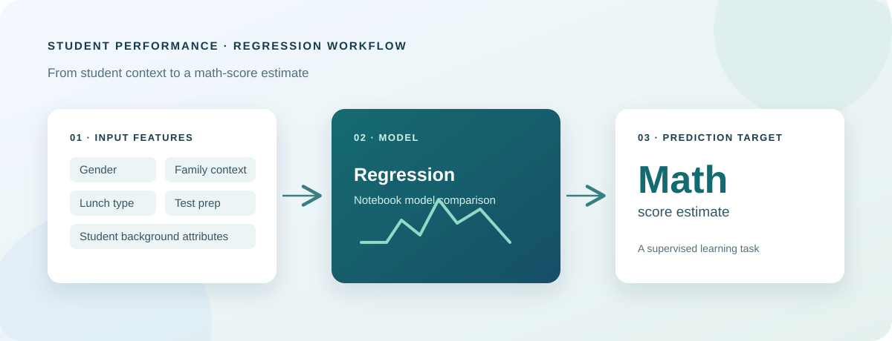

<div align="center">

# Student Performance Prediction

### Exploring student outcomes and estimating mathematics scores with machine learning

[](https://www.python.org/)
[](https://scikit-learn.org/)
[](https://catboost.ai/)
[](https://xgboost.readthedocs.io/)
[](https://jupyter.org/)
[](#chapter-9-project-status-and-limitations)

<br />



</div>

A repository for exploring the StudentsPerformance dataset and experimenting with regression models for student mathematics scores. It includes exploratory analysis, a model-training notebook, and a modular Python source layout for developing an end-to-end machine learning workflow.

> **Repository note:** The notebooks and checked-in dataset are the clearest runnable analysis path in the current project. Some package pipeline modules are empty scaffolds, and the data-ingestion script currently points to a different CSV filename; details and workarounds are documented below.

## Contents

- [Chapter 1: Project Overview](#chapter-1-project-overview)
- [Chapter 2: Problem and Objectives](#chapter-2-problem-and-objectives)
- [Chapter 3: Dataset](#chapter-3-dataset)
- [Chapter 4: Exploratory Analysis](#chapter-4-exploratory-analysis)
- [Chapter 5: Model Training](#chapter-5-model-training)
- [Chapter 6: Repository Architecture](#chapter-6-repository-architecture)
- [Chapter 7: Setup and Usage](#chapter-7-setup-and-usage)
- [Chapter 8: Reproducibility and Responsible Use](#chapter-8-reproducibility-and-responsible-use)
- [Chapter 9: Project Status and Limitations](#chapter-9-project-status-and-limitations)

---

## Chapter 1: Project Overview

This project examines how student background and preparation indicators relate to academic outcomes, then frames mathematics score prediction as a supervised regression task. The repository combines Jupyter notebooks for analysis and experiments with Python modules intended to organize data ingestion, transformation, model training, and prediction.

### At a glance

| | |
|---|---|
| **Task** | Regression |
| **Target** | `math score` |
| **Data** | Student demographic/context features and subject scores |
| **Analysis** | Exploratory data analysis and model comparison notebooks |
| **Implementation** | Python, pandas, scikit-learn, CatBoost, XGBoost |

## Chapter 2: Problem and Objectives

The modeling task is to estimate a student's mathematics score from the available student attributes and, in the notebook experiment, reading and writing scores. The notebooks also explore score distributions and relationships across student groups and preparation categories.

Project objectives:

- Inspect the dataset, its feature types, and score distributions.
- Explore relationships between student context and academic scores.
- Compare candidate regression estimators using a held-out test set.
- Organize reusable workflow code into ingestion, transformation, training, and prediction modules.

This is an educational modeling exercise, not a validated decision system. Associations in this dataset do not establish that demographic or socioeconomic attributes cause differences in academic results.

## Chapter 3: Dataset

The included file is [`notebook/data/StudentsPerformance.csv`](notebook/data/StudentsPerformance.csv). The notebook reports 1,000 records and eight columns.

| Column | Role | Description |
|---|---|---|
| `gender` | Input | Student gender category |
| `race/ethnicity` | Input | Student group category |
| `parental level of education` | Input | Reported parental education category |
| `lunch` | Input | Lunch category |
| `test preparation course` | Input | Test preparation completion category |
| `reading score` | Input in training notebook | Reading assessment score |
| `writing score` | Input in training notebook | Writing assessment score |
| `math score` | Target | Mathematics assessment score |

The EDA notebook derives additional values such as total score and average score for analysis. Avoid using a derived value that includes the target as a predictor: doing so would leak target information into model training.

## Chapter 4: Exploratory Analysis

Open [`notebook/1 . EDA STUDENT PERFORMANCE .ipynb`](<notebook/1 . EDA STUDENT PERFORMANCE .ipynb>) to review the data inspection and analysis. The notebook explores:

- Dataset dimensions, column types, and missing-value counts.
- Numerical score distributions and summary statistics.
- Total and average scores derived from the three subject scores.
- Score comparisons across gender, parental education, lunch, and test-preparation groups.
- Visual summaries using pandas, Matplotlib, and Seaborn.

Notebook outputs are useful as a recorded exploratory snapshot. Re-run cells from the top to regenerate results in your own environment.

## Chapter 5: Model Training

Open [`notebook/2. MODEL TRAINING.ipynb`](<notebook/2. MODEL TRAINING.ipynb>) for the regression experiment. The notebook sets `math score` as the target and removes it from the feature set; it then compares regression estimators, including CatBoost and XGBoost models, using a train/test evaluation workflow.

The committed notebook output reports an R² score of approximately **0.8516** for the CatBoost regressor. Treat this as the result recorded in that notebook, not as a guarantee: results depend on the split, preprocessing, and library versions. Re-run the notebook to verify current results.

## Chapter 6: Repository Architecture

```text
Student_Perfromance_prediction/
├── assets/
│   └── student-performance-workflow.svg
├── notebook/
│   ├── 1 . EDA STUDENT PERFORMANCE .ipynb
│   ├── 2. MODEL TRAINING.ipynb
│   ├── data/
│   │   └── StudentsPerformance.csv
│   └── catboost_info/                 # CatBoost training output
├── src/
│   ├── component/
│   │   ├── data_ingection.py          # Data ingestion and train/test split
│   │   ├── datatransformation.py      # Scaffold
│   │   └── model_trainer.py            # Scaffold
│   ├── pipeline/
│   │   ├── predict_pipeline.py         # Scaffold
│   │   └── train_pipeline.py           # Scaffold
│   ├── exception.py                    # Custom exception formatting
│   ├── logger.py                       # Timestamped file logging
│   └── utils.py                        # Scaffold
├── requirements.txt
├── setup.py
└── readme.md
```

### Source modules

- **Data ingestion:** `src/component/data_ingection.py` defines an ingestion configuration and writes raw, training, and test CSV artifacts beneath `artifacts/`.
- **Logging:** `src/logger.py` configures timestamped logs in a `logs/` directory.
- **Custom exceptions:** `src/exception.py` adds file and line context to exceptions.
- **Remaining modules:** transformation, model training, utility, and pipeline files are currently empty in the checked-in project state.

## Chapter 7: Setup and Usage

### Requirements

- Python 3.x.
- Git, if cloning the repository.
- Internet access for installing dependencies.

The exact tested Python version is not pinned in the repository. CatBoost and XGBoost may require platform-specific wheels or build dependencies on some systems.

### Install

```powershell
git clone <your-repository-url>
cd Student_Perfromance_prediction
py -m venv .venv
.venv\Scripts\Activate.ps1
python -m pip install --upgrade pip
pip install -r requirements.txt
```

Replace `<your-repository-url>` with the actual repository URL. No Git remote is configured in the current workspace, so a public clone URL cannot be supplied here.

### Run the notebooks

```powershell
cd notebook
pip install jupyter
jupyter notebook
```

Start Jupyter from the `notebook` directory so the notebooks' relative `data/StudentsPerformance.csv` paths resolve correctly. Run the EDA notebook first, followed by the model-training notebook.

### Package installation

The requirements include `-e .`, which installs the local project in editable mode via `setup.py`. This is useful for importing project modules while developing, but it does not provide a command-line training or prediction entry point in the current state.

## Chapter 8: Reproducibility and Responsible Use

For comparable results, record Python and dependency versions, keep the train/test split and random seed consistent, and run notebooks from a clean kernel in top-to-bottom order. Model metrics should be evaluated on data held out from training, with preprocessing fitted only on the training partition.

Student attributes include sensitive and socioeconomic context. Use any analysis for learning and aggregate insight, not for high-stakes decisions about individual students. A correlation or model prediction is not a causal explanation and should not be interpreted as an assessment of a student's ability or potential.

## Chapter 9: Project Status and Limitations

The repository provides a dataset, two analysis notebooks, dependency declarations, logging and exception helpers, and an initial ingestion component. It does not currently include a completed, executable end-to-end training or serving pipeline.

Known implementation gaps:

- **Ingestion path mismatch:** the ingestion script reads `notebook\data\stud.csv`, but the checked-in file is `notebook/data/StudentsPerformance.csv`. As written, direct execution of `data_ingection.py` will not find the included dataset unless the path is corrected.
- **Empty modules:** the transformation, model trainer, utility, and train/predict pipeline files do not yet implement their advertised workflows.
- **Notebook dependency:** model comparison currently lives in the notebook rather than in an executable source pipeline.
- **No serving interface:** there is no API, web application, or command-line prediction interface in the current project.
- **No license declared:** add a license file and update the badge if you intend to specify reuse terms.

### Suggested next steps

1. Correct the ingestion dataset path and add a small ingestion smoke test.
2. Implement preprocessing for categorical and numerical features in a reusable scikit-learn pipeline.
3. Move notebook model comparison into `model_trainer.py` and save the selected model artifact.
4. Add evaluation metrics, cross-validation, and reproducible configuration.
5. Implement a prediction entry point and document its input schema.
6. Add tests and CI before treating the workflow as production-ready.

---

<div align="center">

**Built for learning, experimentation, and responsible analysis of student performance data.**

</div>
